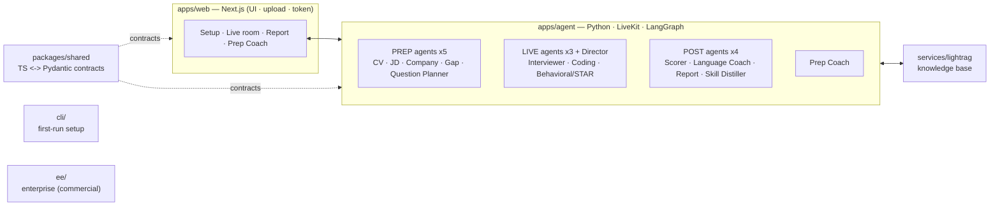
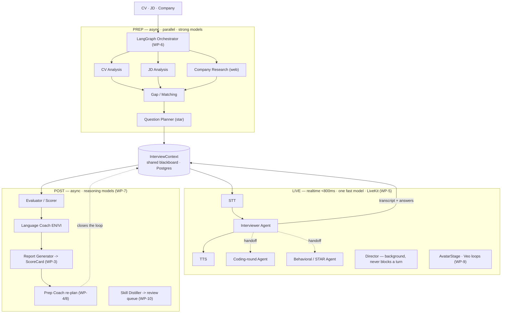
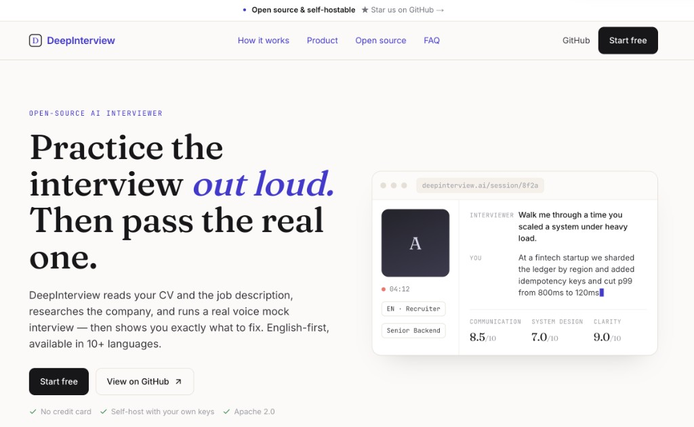
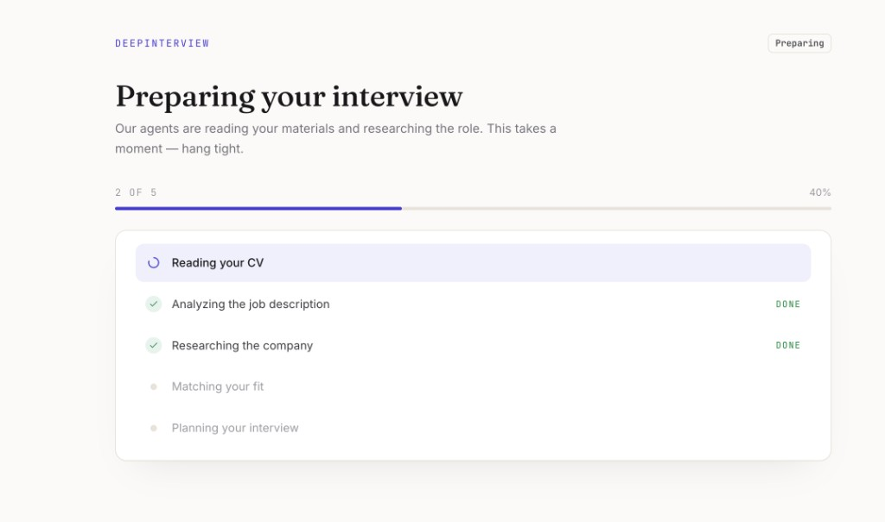
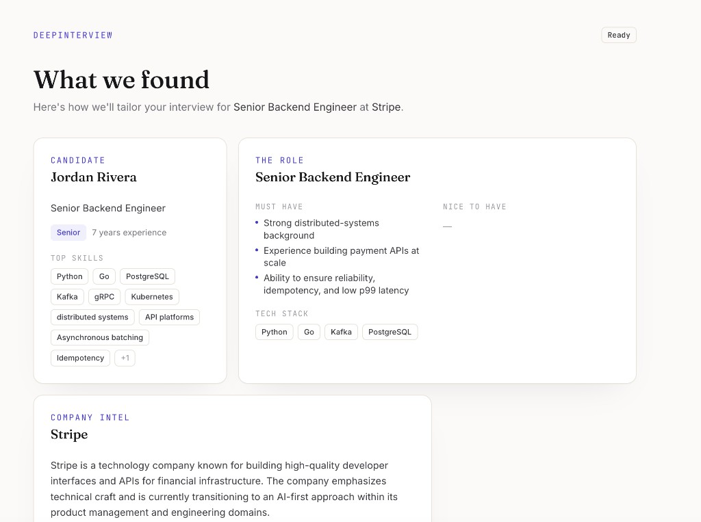

<div align="center">


# DeepInterview: Voice-First, Multilingual AI Mock Interviewer

### Practice the interview out loud. Then pass the real one. · Multi-agent · Open source

[](LICENSE)
[](https://github.com/ngoanpv/DeepInterview/actions)
[](https://github.com/ngoanpv/DeepInterview/releases)
[](https://github.com/ngoanpv/DeepInterview/stargazers)
[](apps/agent)
[](pnpm-workspace.yaml)
[](#-community)

**🌐 UI in English + Tiếng Việt · voice interviews in 7 languages incl. Vietnamese (more as packs land) · no sign-in required to self-host**

[Why](#-why-deepinterview) · [Features](#-features) · [Quickstart](#-quickstart) · [Architecture](#️-architecture) · [Community](#-community) · [Contributing](#-contributing)

</div>

---

<!-- HERO: a 15–40s GIF of a real voice interview + the scorecard. -->
<!-- The file is not recorded yet — see assets/README.md (it's the top launch-checklist item). -->


> **🚧 demo.gif is a placeholder.** The hero demo is the launch-critical asset and has not been recorded yet — see [`assets/README.md`](assets/README.md).

> **Upload your CV and a job description. Talk to an AI interviewer. Get scored — and coached on exactly what you missed.** Voice-first, English-first, and multilingual by design.

DeepInterview closes the **prep ⇄ interview ⇄ feedback** loop: heavy reasoning runs *before* the call (read your CV + the JD, research the company, build an adaptive question plan), a lean real-time voice loop runs the interview, then strong models score it and route you into a study coach for your weak areas.

> **Honest status:** this is an **early open build**. The contracts, prep/live/post pipelines, web screens, and CLI are implemented and **run offline with mock adapters** (no API keys, tests green). Real-time voice, web research, and video avatars need provider keys. `docker compose up` brings up the full base stack (web + agent API + knowledge sidecar, healthy with zero keys); the live voice worker runs via `docker compose --profile live up` once LiveKit keys are set. We mark what's done honestly, per feature, throughout this README.

## 🤔 Why DeepInterview

Most interview-prep tools are either chat-only, closed-source, or a per-minute SaaS you can't run yourself. DeepInterview is built differently: it's **voice-first** (you practice out loud, like the real thing), **multilingual** (UI in EN+VI, voice in 7 languages including Vietnamese), and **fully self-hostable** under AGPLv3 with your own provider keys — and it **runs anonymously**: no account, no login, no data leaving your box unless you choose a provider.

| | **DeepInterview** | Final Round AI | Interview Coder | Generic chat prep |
|---|:---:|:---:|:---:|:---:|
| Real-time **voice** interview | ✅ | ✅ | ❌ (coding-overlay) | ❌ (text) |
| **Multilingual** (incl. Vietnamese) | ✅ | partial | ❌ | varies |
| **Self-hostable** | ✅ | ❌ | ❌ | ❌ |
| **Bring-your-own keys** | ✅ | ❌ | ❌ | ❌ |
| **Scored, rubric-based** feedback | ✅ | ✅ | ❌ | varies |
| **Open source** | ✅ AGPLv3 | ❌ | ❌ | mostly ❌ |
| Works **without sign-in** | ✅ | ❌ | ❌ | ❌ |

<sub>Competitor columns reflect their publicly advertised positioning at time of writing; check their sites for current details. "Generic chat prep" = ChatGPT-style text Q&A without a voice loop or scored rubric.</sub>

## 📰 News

> - **[2026.06]** 🧱 **Early build is up.** Cross-language `InterviewContext` contract (TS ↔ Pydantic) round-trips; prep/live/post pipelines and all web screens run **offline with mock adapters**. Pre-launch.
> - **[next]** 🎙️ First end-to-end voice interview on real providers (STT→LLM→TTS on LiveKit) + the hero demo GIF.
> - **[next]** 🌐 More language packs and the hosted live demo.

_(Changelog is intentionally pre-launch and honest — no "1,000 stars" or shipped-feature claims until they're true.)_

## 📦 Releases

No tagged release yet — DeepInterview is pre-`v0.1`. Watch [Releases](https://github.com/ngoanpv/DeepInterview/releases) and the News section above. Citation metadata lives in [`CITATION.cff`](CITATION.cff).

## ✨ Features

- **🎙️ Real-time voice interview** — cascaded **STT → LLM → TTS** on LiveKit (not speech-to-speech), so you get a full transcript, per-component control, and predictable cost. Barge-in and seeded follow-ups keep it conversational.
- **🌐 English-first & multilingual** — every user-facing string is i18n'd (UI shipped in EN + VI); language is a per-session setting and the voice pipeline routes STT/TTS by language (see the [provider matrix](#-provider-matrix) below). Each language is a pluggable "pack."
- **🧠 Personalized prep** — a LangGraph pipeline reads your CV + the JD, researches the target company, diffs the gap, and a **Question Planner** precomputes the plan, difficulty curve, rubrics, and seeded follow-ups — so the live loop stays fast. Uploaded **CV documents (PDF/DOCX) are parsed to text server-side with [Microsoft markitdown](https://github.com/microsoft/markitdown), with a Gemini multimodal fallback for scanned/image PDFs**.
- **📊 Scored feedback** — a rubric-based evaluator + language coach write a per-competency `ScoreCard` with strengths, gaps, model answers, and next steps that map straight back to the questions you were asked.
- **📚 Prep Coach** *(in progress)* — turns your gaps into an LLM study loop (plan → drills → Socratic chat). Grounded + cited answers are **optional**: set `LIGHTRAG_URL` (or wire a managed RAG behind the same adapter) to ground responses in your own uploaded materials; by default the coach answers honestly without fabricated citations.
- **🎭 Cost-smart avatars** *(in progress)* — the crossfade system + persona fallbacks are built; pre-rendered **Veo 3.1** idle/speaking loops drop in as the assets land (until then it renders a calm gradient stage). Original anime / superhero / recruiter personas (no named IP), so runtime cost is **CDN-only — no per-minute avatar fees**.
- **🔌 Provider-agnostic & self-hostable** — a clean adapter layer (LLM / search / embeddings, with a **mock adapter** for offline dev). Bring your own keys (Soniox/Deepgram, Cartesia/ElevenLabs, Gemini/GPT, or OSS faster-whisper / XTTS / Qwen3).
- **🔓 Open source (AGPLv3)** — self-host the whole thing. Any paid/enterprise-only code is isolated under [`ee/`](ee/README.md).

## 🔊 Provider matrix

The live voice loop is **cascaded STT → LLM → TTS** over LiveKit, with each stage chosen by a `*_PROVIDER` env var. With no keys set, every stage falls back to an offline **mock adapter** so the full loop runs in CI and on day-one clones.

| Stage | Default provider(s) | Notes | OSS / offline fallback |
|---|---|---|---|
| **STT** | Deepgram **nova-3** | English + many languages; Vietnamese on nova-3 is being validated. Soniox = BYO alternative. | mock adapter (faster-whisper planned) |
| **TTS** | Cartesia **sonic** | en, es, zh, fr, de, ja, pt, hi, it, ko, nl, pl, ru, sv, tr | mock adapter (XTTS planned) |
| **TTS** | ElevenLabs **Flash v2.5** | **Vietnamese** + other non-Cartesia languages | — |
| **TTS** | Gemini TTS | fallback when no ElevenLabs key is set | — |
| **LLM** | Gemini (live tier) / OpenAI | live + prep/post reasoning | mock adapter (Qwen3 planned) |

## 🚀 Quickstart

> **🔓 No sign-in required.** The OSS self-host runs **anonymously** — setup, the live interview, and the report all work with **no account and no login**. (The report reads directly from the agent API.) Supabase auth + billing are a **hosted-only** layer; you don't need them to run the loop yourself.
>
> **⚡ Zero-upload demo:** the `/setup` screen has a one-click **Quick demo** that fills a sample CV + JD, so you can try the whole loop without uploading anything.

**Requirements:** Node **20+** (22 recommended — see [`.nvmrc`](.nvmrc)) · pnpm 11 · Python 3.11+ with [uv](https://docs.astral.sh/uv/) (for the agent) · Docker (for the full stack).

### 1. Offline path (verified — no API keys needed)

This is what's tested in CI today. It builds the contracts, runs the test suites, and exercises the prep/live/post pipelines against **mock adapters** — no provider keys required.

```bash
git clone https://github.com/ngoanpv/DeepInterview.git
cd deepinterview

pnpm install          # install the JS/TS workspace
pnpm build            # build packages/shared (contracts) + cli + web
pnpm test             # TS + Pydantic parity + pipeline tests (offline, mock adapters)

pnpm deepinterview init   # scaffold .env from .env.example (fill in keys later)
```

> `pnpm build` must run before `pnpm deepinterview init` — the CLI is built into `cli/dist/`.
> For the Python agent: `uv --directory apps/agent sync` then `uv --directory apps/agent run pytest`.

### 2. Full-stack path (`docker compose up` — verified)

```bash
pnpm deepinterview init    # or: cp .env.example .env  (keys are optional — see note)
docker compose up --build  # web (:3000) + agent API (:8000) + lightrag (:9621)
```

> **Status (verified June 2026, Docker 29 / Compose v5):** all images build and the three base services come up **healthy with zero keys** — the agent runs the full prep → plan → score loop on mock adapters, and http://localhost:3000 works offline.
>
> - **Docker reads the repo-root `.env`** (compose `env_file`). Local dev (`pnpm dev`) instead reads `apps/agent/.env` and `apps/web/.env.local` — keys there are **not** visible to the containers, so put them in the root `.env` for Docker.
> - The **live voice worker** is opt-in: `docker compose --profile live up`. It **requires** `LIVEKIT_URL` / `LIVEKIT_API_KEY` / `LIVEKIT_API_SECRET` (plus STT/TTS/LLM keys) in the root `.env`; without them the worker exits and restart-loops while the base stack keeps running.

### 3. One-click deploy

[](https://vercel.com/new/clone?repository-url=https://github.com/ngoanpv/DeepInterview)

The button deploys **`apps/web`** to Vercel. The Python **agent** is not serverless — run it via **Docker** (the `agent-api` image above) or on **[LiveKit Cloud Agents](https://docs.livekit.io/agents/)** for the live voice worker, and point the web app at it with `AGENT_API_URL`. See [`docs/DEPLOY.md`](docs/DEPLOY.md) (WP-12, in progress).

<details><summary>Configuring providers & adding a language pack</summary>

- **Keys** live in `.env` only (never committed). See [`.env.example`](.env.example) for the full list (LiveKit, Supabase, R2, STT/TTS/LLM, Tavily/Exa, payments, observability).
- **Provider choice** is per-component: set `STT_PROVIDER`, `TTS_PROVIDER`, `LLM_PROVIDER` and the matching key. With no keys set, the agent falls back to **mock adapters** so everything still runs offline.
- **Languages** are pluggable packs. UI strings live in `apps/web/lib/i18n/messages/` (EN + VI shipped); each planned question's `text` is a `LocalizedText` map (`text.en` / `text.vi` / …) alongside a `language_mode`.

See [CONTRIBUTING.md](CONTRIBUTING.md) for the full dev setup and the provider-adapter pattern.

</details>

## 🏗️ Architecture

The spine of the system is a **prep / live / post** split (strong async models before and after the call; one lean fast model on the live turn path). All three phases thread a single shared `InterviewContext` "blackboard" — written in prep, read+appended in live, read in post.

**Overview — agents & repo design:**



**Request flow — prep → live → post:**



**Module boundaries:** `apps/web` owns UI/auth/upload/token and knows nothing about LLM/STT/TTS · `apps/agent` owns the voice loop + prep/post pipelines + avatar render util · `services/lightrag` owns the knowledge base · `cli/` owns first-run setup · **`packages/shared` is the cross-language contract** (TS source of truth, mirrored as Pydantic). See [`docs/ARCHITECTURE.md`](docs/ARCHITECTURE.md) and the full spec in [`site/AI-Interviewer-Build-Handoff.md`](site/AI-Interviewer-Build-Handoff.md).

## 📦 Using DeepInterview

| Edition | What you get | Auth & billing | Status |
|---|---|---|---|
| **Self-host (AGPLv3)** | The whole platform, your keys, your data. Runs **anonymously** — no sign-in. | None required | ✅ Available now (this repo) |
| **Cloud (hosted)** | Managed hosting with accounts + plan tiers, so you skip the ops. | Supabase auth + billing | 🟡 Planned (pre-launch) |
| **Enterprise (`ee/`)** | SSO / RBAC / audit logging under a separate commercial license, kept out of the AGPL core. | Org SSO | 🟡 Scaffolded |

> The **auth + billing layer is hosted-only** — the open-source self-host runs the full prep → interview → report → coach loop without any account. See [`ee/`](ee/README.md) for the enterprise boundary.

## 📸 Screenshots

> Placeholders — see [`assets/README.md`](assets/README.md). The screens exist (`/setup`, `/interview/[id]`, `/report/[id]`); polished captures land with the demo.

| Setup | Live interview | Report |
|---|---|---|
|  |  |  |

## 🌐 Community

- 💬 **Discord** — join the build-in-public chat _(invite link TBD — opens at launch)_.
- 🗣️ **[GitHub Discussions](https://github.com/ngoanpv/DeepInterview/discussions)** — questions, ideas, language-pack requests.
- 🐛 **[Issues](https://github.com/ngoanpv/DeepInterview/issues)** — bugs & features (templates provided).

Built in the open. We respond to issues — ghosting contributors is the #1 cause of OSS death, and we don't intend to.

## 🤝 Contributing

We'd love your help — especially **language packs**, **provider adapters**, and **accessibility**. Start with:

- 📖 [CONTRIBUTING.md](CONTRIBUTING.md) — dev setup, the monorepo map, the work-package model, the provider-adapter (mock-first) pattern, and how to run **offline with no keys**.
- 🌱 [Good first issues](docs/GOOD_FIRST_ISSUES.md) — concrete, scoped tasks drawn from real gaps.
- 📜 [Code of Conduct](CODE_OF_CONDUCT.md) · 🔒 [Security policy](SECURITY.md).

<!-- Contributor mosaic — populates after the repo is public (contrib.rocks reads the public contributor list). -->
[](https://github.com/ngoanpv/DeepInterview/graphs/contributors)

> _The mosaic above renders once the repo is public and has contributors._

## 📖 Citation

If DeepInterview helps your work, please cite it. Full metadata is in [`CITATION.cff`](CITATION.cff).

```bibtex
@software{deepinterview2026,
  title  = {DeepInterview: Voice-First, Multilingual AI Mock Interviewer},
  author = {The DeepInterview contributors},
  year   = {2026},
  license = {AGPL-3.0-only},
  url    = {https://github.com/ngoanpv/DeepInterview}
}
```

---

<div align="center">

**License:** [AGPL-3.0-only](LICENSE) for the core · commercial terms for [`ee/`](ee/README.md). · Built in the open 🌍

[⬆ back to top](#deepinterview-voice-first-multilingual-ai-mock-interviewer)

</div>
