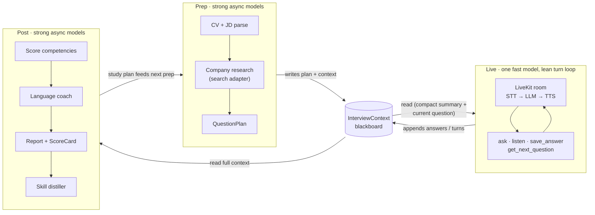

# Architecture

A concise tour of how DeepInterview is put together. For the full specification —
agent prompts, work packages (WP-0…WP-13), acceptance criteria, and the
dependency graph — read [`site/AI-Interviewer-Build-Handoff.md`](../site/AI-Interviewer-Build-Handoff.md)
(start at §16).

DeepInterview is a voice-first AI mock-interview platform: it reads a
candidate's CV + a job description, researches the target company, runs an
adaptive real-time voice interview with a stylized avatar, scores it, then
routes the user into a study coach that teaches weak areas — a closed
prep ⇄ interview ⇄ feedback loop. English-first, multilingual, AGPLv3.

## The prep / live / post split

The single most important design decision: **heavy reasoning happens before and
after the call, never on the live turn path.** A voice turn must feel instant,
so the live loop runs exactly one lean fast model against a precomputed plan and
does no blocking I/O on the critical path.

| Phase    | When                | Models                                   | Job |
| -------- | ------------------- | ---------------------------------------- | --- |
| **Prep** | before the call     | strong async models (LangGraph pipeline) | Parse CV + JD, research the company, build the `InterviewContext` blackboard and a `QuestionPlan`. |
| **Live** | during the call     | one fast model on the turn path          | Ask the planned questions, listen, record answers/turns. No web search, no scoring, no DB reads mid-turn. |
| **Post** | after the call      | strong async models (LangGraph pipeline) | Score competencies, language-coach, write the report; distill reusable skills. |



<details>
<summary>ASCII fallback (same flow)</summary>

```
   PREP (strong async)         LIVE (one fast model)          POST (strong async)
 ┌───────────────────┐       ┌──────────────────────┐       ┌────────────────────┐
 │ CV+JD parse        │       │ LiveKit room          │       │ score competencies  │
 │ company research   │       │ STT → LLM → TTS        │       │ language coach      │
 │ → QuestionPlan     │       │ ask·listen·save_answer │       │ → report + ScoreCard│
 └─────────┬──────────┘       │ get_next_question      │       │ → skill distiller   │
           │ writes           └──────────┬─────────────┘       └─────────┬──────────┘
           ▼                             │ appends                       │ reads
        ┌───────────────────────  InterviewContext (blackboard)  ───────────────────┐
        │  written in prep   ·   read + appended in live   ·   read in post           │
        └───────────────────────────────────────────────────────────────────────────┘
           ▲                                                              │
           └──────────────  study plan loops back into next prep  ◄───────┘
```

</details>

## The `InterviewContext` blackboard

`InterviewContext` is the shared contract every phase reads or writes — the
"blackboard" that ties prep → live → post together. It is defined once in
[`packages/shared`](../packages/shared) (TypeScript) and mirrored as Pydantic in
the agent (`apps/agent/.../shared_models.py`), with a parity test
(`apps/agent/tests/test_parity.py`) and round-trip fixtures keeping the two in
sync.

- **Prep writes it.** The LangGraph prep pipeline produces the candidate
  summary, company intel, job spec, and the `QuestionPlan`.
- **Live reads + appends it.** The interviewer injects only a *compact* slice
  (candidate summary + current question + last turns) into the fast model's
  prompt, and appends `AnswerRecord`s and transcript turns as the conversation
  proceeds (`live/state.py`, via the `save_answer` / `get_next_question`
  function tools).
- **Post reads it.** Scoring, language coaching, and the report read the full
  context; the report screen loads the persisted `sessions.context` +
  `sessions.scorecard` rows (falling back to sample data offline so the report
  always renders).

Keeping the live prompt small (golden rule 2) is what keeps the turn path fast.

## The provider-adapter pattern (mock-first)

Every external provider sits behind a narrow interface, so the core logic never
imports a vendor SDK directly. Adapters live in
[`apps/agent/src/deepinterview_agent/core/adapters/`](../apps/agent/src/deepinterview_agent/core/adapters):
`base.py` defines `Protocol`s (LLM, Search, Embeddings; the knowledge backend
has its own interface), and `mock.py` provides deterministic implementations.

The default wiring is **mock-first and offline**: the full prep → live → post
loop runs with **no API keys at all**, which is what CI and local development use.
Swapping in a real provider (Gemini/GPT for the LLM, Deepgram/Soniox for STT,
Cartesia/ElevenLabs for TTS, Tavily for search, bge-m3 for embeddings) means
adding one adapter behind the existing interface — not touching call sites. The
web side mirrors this with billing/storage/knowledge helpers that degrade to a
safe offline path when their env vars are unset.

## Package map

```
deepinterview/
├── apps/
│   ├── web/                 # Next.js 15 (App Router) + React 19 + Tailwind v4 + shadcn/ui
│   │   ├── app/api/         # token · upload · kb/query (proxy) · billing/webhook · health
│   │   ├── app/{setup,interview,report,prep,...}/   # screens
│   │   ├── components/      # interview · report · prep · avatar · ui
│   │   └── lib/             # i18n · plan/billing · supabase · livekit · r2 · kb
│   └── agent/               # Python 3.11+ LiveKit worker + LangGraph pipelines
│       └── src/deepinterview_agent/
│           ├── api/         # FastAPI routers: /api/prep, /api/score
│           ├── prep/        # LangGraph prep pipeline (graph · nodes · prompts · state)
│           ├── live/        # LiveKit interviewer · director · handoffs · state · kb_tool
│           ├── post/        # evaluator · language_coach · report
│           ├── core/        # adapters · config · deps · persistence · observability
│           └── skilllib/    # skill distiller · scrub · promote · store
├── packages/shared/         # TS ↔ Pydantic contracts (InterviewContext, QuestionPlan, …) + JSON schema
├── services/lightrag/       # knowledge sidecar (FastAPI, :9621) — /kb/ingest, /kb/query
├── cli/                     # developer/operator CLI
├── skills/                  # versioned company playbooks + rubrics (Markdown + YAML)
├── ee/                      # enterprise-only (SEPARATE COMMERCIAL LICENSE — not AGPLv3)
└── docs/ · site/            # these docs · source-of-truth spec + landing reference
```

`packages/shared` is built **first** (WP-0): nothing else compiles until those
contracts round-trip JSON between web and agent.

## REST and room contracts

Three processes expose HTTP. Paths below are the real route definitions in the
code, not shorthand.

| Endpoint            | Method | Served by                          | Purpose |
| ------------------- | ------ | ---------------------------------- | --- |
| `/api/prep`         | POST   | **agent** FastAPI (`apps/agent`)   | Run the prep pipeline → `InterviewContext` + `QuestionPlan`. |
| `/api/score`        | POST   | **agent** FastAPI (`apps/agent`)   | Run the scoring/post pipeline → `ScoreCard`. |
| `/health`           | GET    | **agent** FastAPI (`apps/agent`)   | Liveness check (`{"ok": true}`). |
| `/api/token`        | POST   | **web** (`apps/web`)               | Mint a scoped LiveKit access token so the browser can join the interview room. |
| `/api/kb/query`     | POST   | **web** (`apps/web`)               | Proxy: forwards to the lightrag sidecar's `/kb/query` (via `LIGHTRAG_URL`). |
| `/kb/ingest`        | POST   | **lightrag** sidecar (`:9621`)     | Ingest documents into a per-user knowledge store. |
| `/kb/query`         | POST   | **lightrag** sidecar (`:9621`)     | Retrieve a grounded answer + citations for a query. |

(The web app also exposes `upload`, `billing/webhook`, and `health` routes; the
lightrag port is configurable via `LIGHTRAG_PORT`, default `9621`.)

**Room contract (live voice).** The browser asks web for a token
(`POST /api/token`), joins the LiveKit room, and talks to the agent worker. The
turn loop is **cascaded STT → LLM → TTS** (not speech-to-speech) so we get
transcripts and per-component control. The interviewer drives the conversation
through two function tools — `save_answer` (record the candidate's answer to the
current question) and `get_next_question` (advance through the precomputed
`QuestionPlan`) — keeping the model's job small and the latency low.

---

For depth on any of the above — the LangGraph node graphs, avatar/Veo prompts,
scoring rubrics, pricing/gating, and the per-WP interface contracts — see
[`site/AI-Interviewer-Build-Handoff.md`](../site/AI-Interviewer-Build-Handoff.md).
